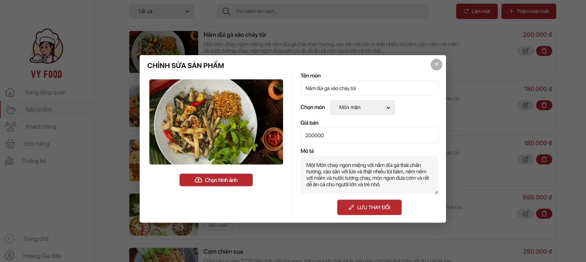

<!-- author: hgbaodev -->
# Vy Food - Microservices E-commerce Platform

A modern microservices-based food delivery platform built with Node.js, Express, MongoDB, Redis, and Docker.

## 🏗️ Architecture

This application has been transformed from a monolithic structure to a microservices architecture:

### Services

1. **API Gateway** (Port 3000)
   - Central entry point for all client requests
   - JWT authentication and authorization
   - Request routing to appropriate services
   - Rate limiting and security

2. **User Service** (Port 3001)
   - User registration and authentication
   - Profile management
   - JWT token generation and validation

3. **Product Service** (Port 3002)
   - Product catalog management
   - Search and filtering
   - Category management
   - Admin product CRUD operations

4. **Cart Service** (Port 3003)
   - Shopping cart management
   - Redis-based session storage
   - Cart persistence with 1-hour expiration

5. **Order Service** (Port 3004)
   - Order processing and management
   - Order history and status tracking
   - Integration with Product Service for pricing

6. **Payment Service** (Port 3005)
   - Payment processing
   - Multiple payment methods support
   - Payment history and refunds

7. **Notification Service** (Port 3006)
   - Email notifications
   - Order status updates
   - User communication

### Databases

- **MongoDB**: Persistent data storage for users, products, orders, payments
- **Redis**: Session storage for carts and temporary data

## 🚀 Quick Start

### Prerequisites

- Docker & Docker Compose
- Node.js 18+ (for local development)
- MongoDB (if running locally)
- Redis (if running locally)

### Using Docker (Recommended)

1. **Clone the repository:**
   ```bash
   git clone <your-repository-url>
   cd Webbanhang
   ```

2. **Navigate to microservices directory:**
   ```bash
   cd microservices
   ```

3. **Start all services:**
   ```bash
   docker-compose up -d
   ```

4. **Access the application:**
   - Frontend: http://localhost:8080
   - API Gateway: http://localhost:3000
   - Admin Panel: http://localhost:8080/admin.html

### Local Development

1. **Install dependencies for each service:**
   ```bash
   cd microservices/api-gateway && npm install
   cd ../user-service && npm install
   cd ../product-service && npm install
   cd ../cart-service && npm install
   cd ../order-service && npm install
   cd ../payment-service && npm install
   cd ../notification-service && npm install
   ```

2. **Set up environment variables:**
   Create `.env` files in each service directory with appropriate configurations.

3. **Start MongoDB and Redis:**
   ```bash
   # Using Docker
   docker run -d -p 27017:27017 --name mongo mongo:6.0
   docker run -d -p 6379:6379 --name redis redis:7-alpine
   ```

4. **Start each service:**
   ```bash
   # In separate terminals
   cd microservices/api-gateway && npm start
   cd microservices/user-service && npm start
   cd microservices/product-service && npm start
   cd microservices/cart-service && npm start
   cd microservices/order-service && npm start
   cd microservices/payment-service && npm start
   cd microservices/notification-service && npm start
   ```

## 🛠️ API Documentation

### Authentication
All protected endpoints require a JWT token in the Authorization header:
```
Authorization: Bearer <your-jwt-token>
```

### User Service API
```
POST /api/users/register       - Register new user
POST /api/users/login          - User login
GET  /api/users/profile        - Get user profile
PUT  /api/users/profile        - Update user profile
PUT  /api/users/change-password - Change password
```

### Product Service API
```
GET  /api/products             - Get all products
GET  /api/products/:id         - Get product by ID
GET  /api/products/search      - Search products
POST /api/products             - Create product (admin)
PUT  /api/products/:id         - Update product (admin)
DELETE /api/products/:id       - Delete product (admin)
```

### Cart Service API
```
GET  /api/cart                 - Get user cart
POST /api/cart/add             - Add item to cart
PUT  /api/cart/update          - Update cart item
DELETE /api/cart/remove/:id    - Remove item from cart
DELETE /api/cart/clear         - Clear cart
```

### Order Service API
```
POST /api/orders               - Create new order
GET  /api/orders               - Get user orders
GET  /api/orders/:id           - Get order by ID
PUT  /api/orders/:id/status    - Update order status
PUT  /api/orders/:id/cancel    - Cancel order
```

### Payment Service API
```
POST /api/payments             - Process payment
GET  /api/payments/:id         - Get payment details
GET  /api/payments/order/:orderId - Get payments for order
GET  /api/payments             - Get payment history
POST /api/payments/:id/refund  - Process refund (admin)
```

## 🔧 Configuration

### Environment Variables

Each service uses the following environment variables:

**Common:**
- `NODE_ENV`: Environment (development/production)
- `PORT`: Service port number

**Database Services:**
- `MONGODB_URI`: MongoDB connection string
- `REDIS_URL`: Redis connection string

**Authentication:**
- `JWT_SECRET`: JWT signing secret

**Email (Notification Service):**
- `SMTP_HOST`: Email server host
- `SMTP_PORT`: Email server port
- `SMTP_USER`: Email username
- `SMTP_PASS`: Email password

### Docker Compose Configuration

The `docker-compose.yml` file includes:
- All microservices
- MongoDB with admin credentials
- Redis for caching
- Nginx for static file serving
- Health checks for all services
- Proper networking between services

## 📦 Deployment

### GitLab CI/CD Pipeline

The project includes a comprehensive GitLab CI/CD pipeline (`.gitlab-ci.yml`) with:

1. **Test Stage**: Run tests for all services
2. **Build Stage**: Build and push Docker images
3. **Deploy Staging**: Deploy to staging environment
4. **Deploy Production**: Blue-green deployment to production
5. **Rollback**: Quick rollback capability

### Required GitLab Variables

Set these variables in your GitLab project settings:

```
# Docker Registry
CI_REGISTRY_IMAGE
CI_REGISTRY_USER
CI_REGISTRY_PASSWORD

# SSH Access
SSH_PRIVATE_KEY
STAGING_HOST
STAGING_USER
PRODUCTION_HOST
PRODUCTION_USER

# Database
STAGING_MONGODB_URI
PRODUCTION_MONGODB_URI
STAGING_REDIS_URL
PRODUCTION_REDIS_URL

# Security
STAGING_JWT_SECRET
PRODUCTION_JWT_SECRET
```

### Manual Deployment

1. **Build all services:**
   ```bash
   cd microservices
   docker-compose build
   ```

2. **Deploy to server:**
   ```bash
   docker-compose up -d
   ```

3. **Health check:**
   ```bash
   curl http://localhost:3000/health
   ```

## 🧪 Testing

### Running Tests

```bash
# Test individual service
cd microservices/user-service
npm test

# Test all services
./scripts/test-all.sh
```

### Health Checks

Each service provides a health endpoint:
- API Gateway: `GET /health`
- Individual Services: `GET /health`

## 📊 Monitoring

### Logs

View logs for all services:
```bash
docker-compose logs -f
```

View logs for specific service:
```bash
docker-compose logs -f user-service
```

### Metrics

Each service exposes basic metrics at `/health` endpoint including:
- Service status
- Uptime
- Database connectivity
- Memory usage

## 🔒 Security

### Authentication & Authorization
- JWT-based authentication
- Role-based access control (customer/admin)
- Password hashing with bcrypt
- Token expiration and refresh

### API Security
- CORS configuration
- Rate limiting
- Input validation with Joi
- SQL injection prevention
- XSS protection

### Data Security
- Encrypted passwords
- Secure card number masking
- Environment variable protection
- HTTPS in production

## 🤝 Contributing

1. Fork the repository
2. Create a feature branch
3. Make your changes
4. Add tests
5. Submit a pull request

### Code Style

- Use ESLint for JavaScript linting
- Follow Airbnb JavaScript style guide
- Write meaningful commit messages
- Include documentation for new features

## 📱 Frontend Integration

The frontend has been updated to work with the microservices:

- `js/api-client.js`: API client for all service communication
- `js/main-microservices.js`: Updated main application logic
- `js/initialization-microservices.js`: Authentication and initialization

### Key Changes from Monolithic Version

1. **Data Storage**: Moved from localStorage to API calls
2. **Authentication**: JWT-based instead of session-based
3. **Product Management**: API-driven instead of static data
4. **Cart Handling**: Server-side cart with Redis storage
5. **Order Processing**: Distributed across multiple services

## 🐛 Troubleshooting

### Common Issues

1. **Services not starting:**
   ```bash
   docker-compose down
   docker-compose up -d --build
   ```

2. **Database connection issues:**
   - Check MongoDB/Redis container status
   - Verify connection strings
   - Check network connectivity

3. **Authentication problems:**
   - Verify JWT secret consistency
   - Check token expiration
   - Validate user permissions

4. **API Gateway errors:**
   - Check service availability
   - Verify proxy configurations
   - Review routing rules

### Debug Mode

Run services in development mode:
```bash
NODE_ENV=development npm run dev
```

## 📝 License

This project is licensed under the MIT License - see the LICENSE file for details.

## 👥 Support

For support and questions:
- Create an issue in the repository
- Contact the development team
- Check the documentation

---

**Vy Food Team** - Building delicious experiences with modern technology! 🍽️
### Tài khoản Admin

- Username: hgbaodev
- Password: 123456
### Hình ảnh giao diện

<h4 align="center">Trang chủ</h4>


<h4 align="center">Chi tiết sản phẩm</h4>


<h4 align="center">Giỏ hàng</h4>


<h4 align="center">Trang admin</h4>


<h4 align="center">Quản lý sản phẩm</h4>
